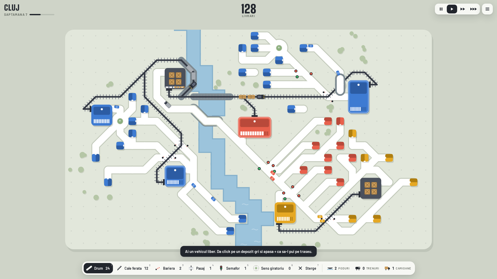

# Sine si Sosele - versiunea 1.0



Joc minimalist de trafic, inspirat de Mini Motorways, in care masinile, trenurile si camioanele impart acelasi oras.
Are case si magazine colorate, drumuri (si in diagonala), cai ferate, depozite, trenuri si camioane de marfa.
Unde drumul taie calea ferata pui bariere sau pasaje, altfel apar accidente. Intersectiile se controleaza cu
semafoare si sensuri giratorii, iar magazinele cresc pana la nivelul 3.

Sunt 5 orase (Cluj, Timisoara, Brasov, Constanta, Bucuresti). Jocul are meniu complet, setari si muzica,
in romana si engleza. Merge pe calculator (Windows, Mac, direct in browser) si pe telefon (iPhone, Android).

**Joaca acum:** descarca repo-ul (butonul verde *Code* -> *Download ZIP*), dezarhiveaza-l si deschide `index.html`.

## Ce e in repo

| Fisier / folder | Ce este |
|---|---|
| `index.html` | Jocul gata de jucat. Dublu-click si se deschide in browser. Merge si fara internet. |
| `src/game.html` | **Sursa jocului** - aici se fac modificarile. |
| `src/fonts/` | Fonturile jocului (Big Shoulders Display, Barlow - licenta SIL Open Font License). |
| `build.py` | Construieste `index.html`, `game/`, `mobile/` si zip-ul din sursa. |
| `game/index.html` | Acelasi joc, folosit de aplicatia desktop (Steam). |
| `mobile/` | Versiunea pentru telefon, care se instaleaza ca aplicatie si merge offline. |
| `sine-si-sosele-web.zip` | Continutul folderului `mobile/`, gata de urcat pe itch.io. |
| `main.js`, `package.json` | Aplicatia desktop (Electron) pentru Steam. |
| `build/icon.png` | Iconita jocului (1024x1024). |
| `store/` | Imaginile pentru pagina de Steam: capsule, logo si 5 capturi 1920x1080. |
| `steam/app_build.vdf` | Sablon pentru urcarea jocului pe Steam (SteamPipe). |
| `.github/workflows/build.yml` | Construieste automat versiunile Windows si Mac pe GitHub (tab-ul *Actions*). |
| `ci/github-build.yml` | Copie a aceluiasi workflow, pentru folosire in afara GitHub. |
| `unelte/` | Teste automate, botul de echilibrare, masurare de performanta, generatoare de imagini. |
| `docs/` | Starea proiectului, deciziile de design si ideile pentru versiunile urmatoare. |
| `istoric/` | Versiunile de lucru prin care a trecut jocul si scripturile de modificare. |

## Cum se joaca

- Casele colorate trimit masini la magazinul de aceeasi culoare. Trage drumuri de la iesirea
  casei (latura alba) pana la intrarea magazinului.
- Magazinele au nevoie de marfa: trenurile o aduc pe cale ferata (6 lazi), camioanele pe drum (4 lazi).
- Unde drumul taie calea ferata pune bariere sau pasaje, altfel apar accidente.
- **Pasajul** este un drum suspendat. Cu unealta Pasaj (4) il tragi in linie dreapta sau pe diagonala,
  peste pana la 10 patratele. Trece pe deasupra caii ferate, a apei, a muntilor si a altor drumuri, dar
  nu peste cladiri. Costa 1 pasaj, iar capetele devin drum. Daca il pui pe o trecere la nivel, o transforma
  in pasaj. Il stergi stergand unul dintre capete.
- Intersectiile cu 3+ drumuri se aglomereaza: pune semafoare sau sensuri giratorii.
- Magazinele bine servite cresc pana la nivelul 3 si au tot mai multi clienti.
- Pierzi cand cercul din jurul unui magazin se umple.
- La sfarsitul fiecarei saptamani primesti +15 drum si alegi un bonus: trenuri +2, camioane +2,
  cale ferata +20, drumuri +30, poduri +7, bariere +2, pasaj +1, semafoare +5, sens giratoriu +3.
- **Depozite:** da click (sau atinge) un depozit gri ca sa-i alegi trenurile si camioanele:
  - `+` pune pe depozit un vehicul liber (daca nu ai vehicule libere, butonul e inactiv);
  - `-` scoate imediat un vehicul si il face liber. Ca sa muti un vehicul la alt depozit,
    apasa intai `-` la depozitul lui, apoi `+` la depozitul nou;
  - bulinele colorate aleg ce culori de magazine aprovizioneaza depozitul.
  Vehiculele castigate la bonusul saptamanal raman libere pana le pui tu pe un depozit.

**Pe calculator:** mouse-ul construieste, click dreapta sterge, rotita mareste harta.
Taste: `1`-`7` unelte (drum, cale ferata, bariera, pasaj, semafor, sens giratoriu, sterge),
`Space` pauza, `F` viteza (1x / 2x / 3x), `Esc` meniu.

**Pe telefon:** trage cu un deget ca sa construiesti. Cu doua degete apropii, departezi si muti harta.
Butonul cu colturi (jos-dreapta) arata din nou toata harta. Pentru stergere foloseste unealta Sterge (X).
Pe telefon tinut orizontal, bara de unelte se muta in stanga ca harta sa fie cat mai mare.

## 1. Joaca pe calculator

Dublu-click pe `index.html`.

## 2. Joaca pe telefon

Ca sa-l instalezi ca aplicatie (cu iconita pe ecran si fara internet), versiunea din `mobile/`
trebuie pusa pe un site cu adresa `https://`. Variante gratuite:

- **GitHub Pages** (direct din acest repo): *Settings* -> *Pages* -> *Deploy from a branch* -> `main`, folder `/ (root)`.
  Jocul de telefon va fi la `https://<utilizator>.github.io/<repo>/mobile/`.
  Pentru un repo privat, GitHub Pages cere un abonament platit; altfel foloseste variantele de mai jos.
- **Netlify Drop:** intra pe https://app.netlify.com/drop si trage folderul `mobile` in pagina.
  Primesti imediat un link.
- **itch.io:** creeaza un proiect de tip HTML, urca `sine-si-sosele-web.zip`, bifeaza
  "This file will be played in the browser" si "Mobile friendly". Asa jocul are si o pagina publica.

Pe telefon deschide linkul, apoi:

- **iPhone (Safari):** butonul Share -> "Add to Home Screen".
- **Android (Chrome):** meniul cu trei puncte -> "Install app" / "Add to Home screen".

Jocul se deschide pe tot ecranul si merge si fara internet.

Mai tarziu, pentru Google Play poti folosi https://www.pwabuilder.com (pornesti de la linkul jocului).
Pentru App Store e nevoie de cont Apple Developer (99 USD/an) si de un Mac cu Xcode.

## 3. Ruleaza ca aplicatie desktop

1. Instaleaza Node.js (versiunea LTS) de pe https://nodejs.org
2. Deschide Terminal in folderul proiectului si scrie:

```
npm install
npm start
```

`F11` = ecran complet.

## 4. Construieste versiunile pentru Steam

- **Mac:** `npm run dist:mac` -> rezultatul e in `out/mac-universal/Sine si Sosele.app`
- **Windows:** pe un PC cu Windows, `npm run dist:win` -> rezultatul e in `out/win-unpacked/`
  (fisierul de pornire este `Sine si Sosele.exe`)
- **Direct pe GitHub, fara PC cu Windows:** intra la tab-ul *Actions*, alege workflow-ul *build*,
  apasa *Run workflow* si descarca versiunile gata facute de la sectiunea *Artifacts*.
  Workflow-ul porneste singur si cand creezi un tag care incepe cu `v` (de exemplu `v1.0.0`).
  La repo-urile private, minutele de Mac se consuma de 10 ori mai repede din cota gratuita.

## 5. Pasii pentru lansarea pe Steam

1. Fa-ti cont pe https://partner.steamgames.com si plateste taxa Steam Direct (100 USD pentru
   fiecare joc; ti se returneaza dupa primii 1.000 USD vanzari). Completeaza datele fiscale si bancare.
2. Creeaza aplicatia. Primesti un **AppID** si ID-uri de **depot** (unul pentru Windows, unul pentru Mac).
3. Pagina magazinului: foloseste imaginile din `store/`:
   - `header_capsule.png` 920x430, `small_capsule.png` 462x174, `main_capsule.png` 1232x706,
     `vertical_capsule.png` 748x896
   - `library_capsule.png` 600x900, `library_hero.png` 3840x1240, `library_logo.png` 1280x720,
     `page_background.png` 1438x810
   - `screenshot_1..5.png` 1920x1080
   - Adauga un trailer scurt (30-60 secunde), filmat direct din joc.
4. Publica pagina ca **Coming Soon** cat mai devreme ca sa strangi wishlist-uri. Steam cere ca
   pagina sa fie vizibila ca "Coming Soon" cel putin 2 saptamani inainte de lansare.
5. Urca jocul: in `steam/app_build.vdf` inlocuieste `0000000` cu AppID-ul tau si `0000001` /
   `0000002` cu ID-urile de depot, apoi urca folderul `out/` cu SteamCMD (din Steamworks SDK).
6. In Steamworks, la *Launch Options*: Windows -> `Sine si Sosele.exe`, macOS -> `Sine si Sosele.app`.
7. Trimite build-ul si pagina la review (dureaza cateva zile), alege pretul, apoi apasa Release.

Regulile si dimensiunile exacte se mai schimba, deci verifica-le in documentatia Steamworks
inainte de trimitere.

## 6. Ce e bine sa mai faci inainte de lansare

- Da jocul la minim 10 oameni si uita-te cum il joaca. Ajusteaza dificultatea dupa ce vezi.
- Verifica daca numele "Sine si Sosele" e liber (cauta pe Steam si la inregistrarea marcilor).
- Optional: achievement-uri Steam (se pot adauga cu biblioteca `steamworks.js`).
- Pentru Mac este recomandata semnarea si notarizarea aplicatiei (cont Apple Developer, 99 USD/an).
  Poti lansa intai doar pe Windows.
- Un demo pentru Steam Next Fest aduce de obicei multe wishlist-uri.
- Idei de continut nou: [docs/idei-viitoare.md](docs/idei-viitoare.md).

## 7. Cum modifici jocul

Tot jocul e intr-un singur fisier: **`src/game.html`**. Dupa ce il modifici, reconstruieste versiunile gata de jucat:

```
pip3 install pillow
python3 build.py
```

Comanda rescrie `index.html`, `game/index.html`, `mobile/` si `sine-si-sosele-web.zip`.
Cand publici o versiune noua pe telefon, mareste numarul din `CACHE` (in `build.py`, la `sw.js`)
ca telefoanele sa descarce versiunea noua.

In partea de sus a scriptului din `src/game.html` gasesti constantele usor de schimbat:

- `CAR_SPEED`, `TRUCK_SPEED`, `TRAIN_SPEED` - viteze
- `TRAIN_CARGO`, `TRUCK_CARGO` - cata marfa duce un tren / un camion
- `LV` - nivelurile magazinelor: stoc, prag de aglomerare, livrari necesare pentru nivel, cerere
- `BASE_DEMAND` - cat de repede apar clienti noi
- `WEEK_LEN` - lungimea unei saptamani (secunde)
- `VIA_MAX` - cat de lung poate fi un pasaj (patratele)
- `CITIES` - orasele: culori, relief, dificultate (`diff`), cate livrari deblocheaza urmatorul oras (`need`)
- `UPG` - bonusurile de la sfarsitul saptamanii
- `STR` - toate textele, in romana si engleza
- in `newGame()`: resursele de la inceput (`res`)

## 8. Teste

Scripturile din `unelte/` folosesc Playwright. O data, in folderul proiectului:

```
npm install --no-save playwright
npx playwright install chromium
```

Apoi, de exemplu:

| Comanda | Ce face |
|---|---|
| `node unelte/test-functional.js` | bonusurile, atribuirea manuala pe depozite, pasajul de 10 |
| `node unelte/test-pasaj.js` | pasajul: construire, masina care trece pe el, stergere |
| `node unelte/test-intersectii.js` | intersectie simpla, semafor, sens giratoriu |
| `node unelte/test-telefon.js` | iPhone 13 si Pixel 7 emulate, vertical si orizontal |
| `node unelte/test-pwa-offline.js` | versiunea de telefon fara internet (porneste intai `python3 -m http.server 8765 -d mobile`) |
| `node unelte/bot-echilibru.js` | un bot joaca toate orasele si masoara cate saptamani rezista |
| `node unelte/performanta.js` | viteza simularii si a desenarii |
| `npx electron unelte/test-electron.js` | porneste aplicatia desktop si verifica jocul |
| `node unelte/imagini-steam.js` | refac imaginile din `store/` |
| `node unelte/iconita.js` | refac `build/icon.png` |

Capturile de ecran ale testelor se salveaza in `unelte/capturi/` (ignorat de git).

## Licenta

Codul si grafica jocului nu sunt open-source: toate drepturile rezervate.
Fonturile din `src/fonts/` sunt sub SIL Open Font License 1.1 (textul licentei este langa ele).
