<div align="center">

<a href="https://seress26.github.io/Joc-Sine-si-Sosele/joaca/">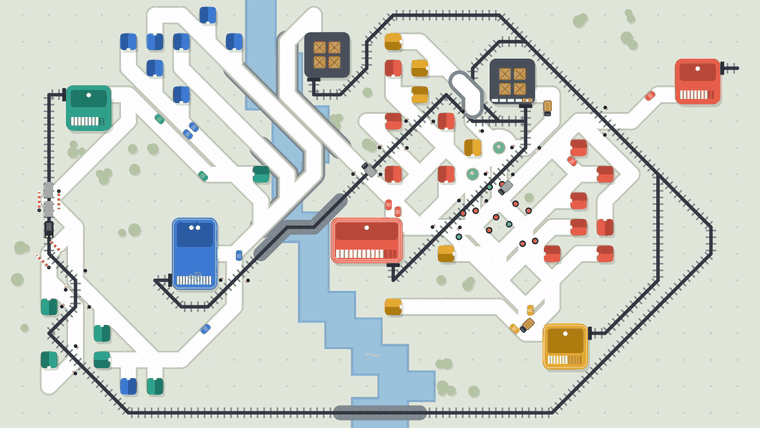</a>

# Sine si Sosele

**Masini, trenuri si camioane intr-un singur oras.**<br>
Joc minimalist de strategie si trafic, pentru calculator si telefon.

<a href="https://seress26.github.io/Joc-Sine-si-Sosele/joaca/"></a>

Merge pe calculator, telefon si tableta. Fara descarcare, fara instalare, fara cont.

[Pagina jocului](https://seress26.github.io/Joc-Sine-si-Sosele/) &nbsp;·&nbsp; [English](#english)


</div>

---

## Despre joc

Traseaza drumuri si cai ferate intr-un oras care creste in fiecare saptamana. Casele colorate trimit masini
la magazinele de aceeasi culoare, iar trenurile si camioanele aduc marfa din depozite. Totul foloseste
aceleasi strazi si aceleasi intersectii, asa ca fiecare drum pe care il tragi se vede imediat in trafic.

Inveti in doua minute. Ca sa rezisti saptamani intregi, trebuie sa gandesti ca un urbanist.

<table>
<tr>
<td width="33%" valign="top"><h3>🚗 Masini</h3>Fiecare casa trimite masini la magazinul de aceeasi culoare. Drumurile le desenezi tu, drept sau in diagonala.</td>
<td width="33%" valign="top"><h3>🚆 Trenuri</h3>Marfa pleaca din depozit pe calea ferata, cate 6 lazi pe tren. Sunt rapide, dar taie drumurile masinilor.</td>
<td width="33%" valign="top"><h3>🚚 Camioane</h3>Duc cate 4 lazi pe aceleasi drumuri ca masinile. Ajung oriunde exista sosea, dar intra si ele in trafic.</td>
</tr>
</table>

## Caracteristici

<table>
<tr>
<td width="33%" valign="top">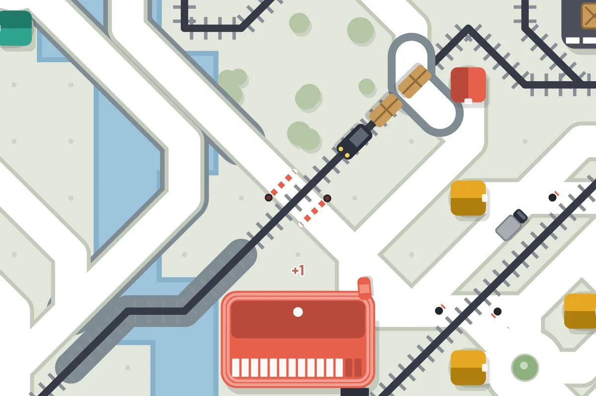<br><b>Treceri la nivel</b><br>Unde drumul taie calea ferata pui bariere. Fara ele, apar accidente.</td>
<td width="33%" valign="top">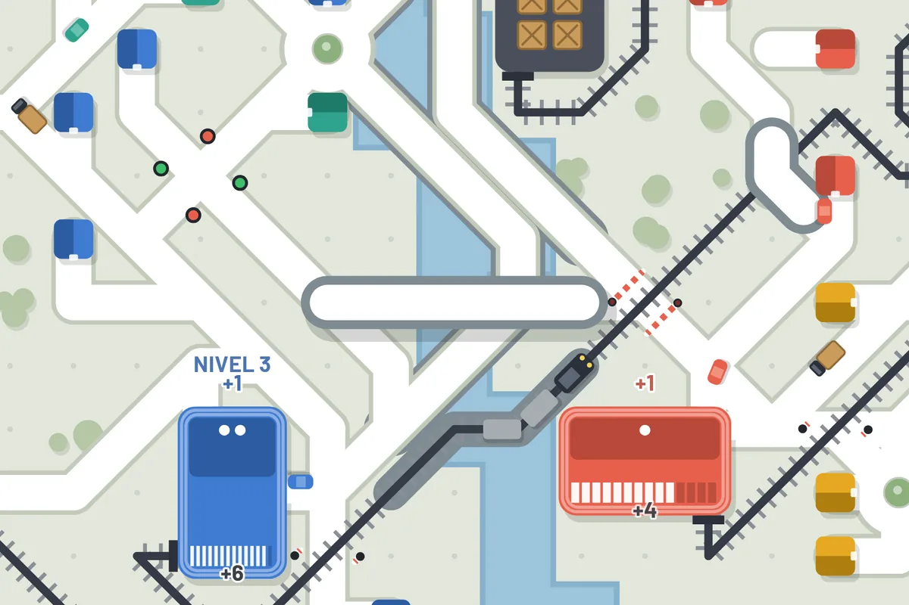<br><b>Pasaje peste orice</b><br>Un drum suspendat sare peste rauri, sine, munti si drumuri, pana la 10 patratele.</td>
<td width="33%" valign="top">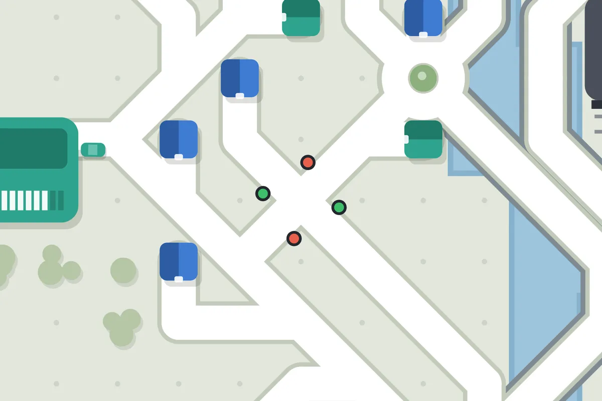<br><b>Semafoare</b><br>Intersectiile cu 3+ drumuri se blocheaza repede. Semafoarele lasa masinile pe rand.</td>
</tr>
<tr>
<td valign="top">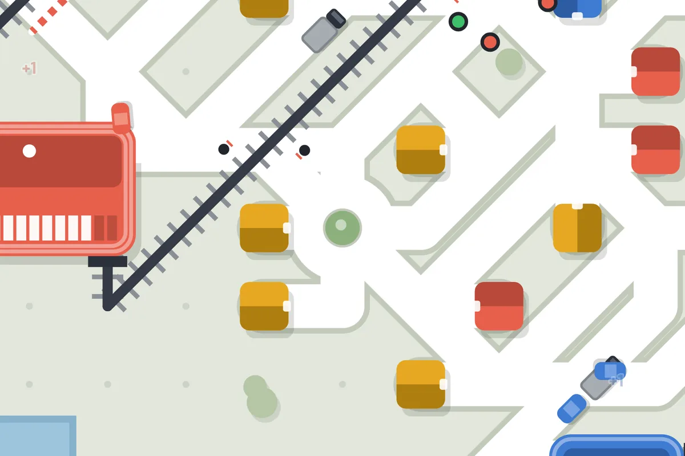<br><b>Sensuri giratorii</b><br>Trafic fluid cand vin masini din toate partile.</td>
<td valign="top">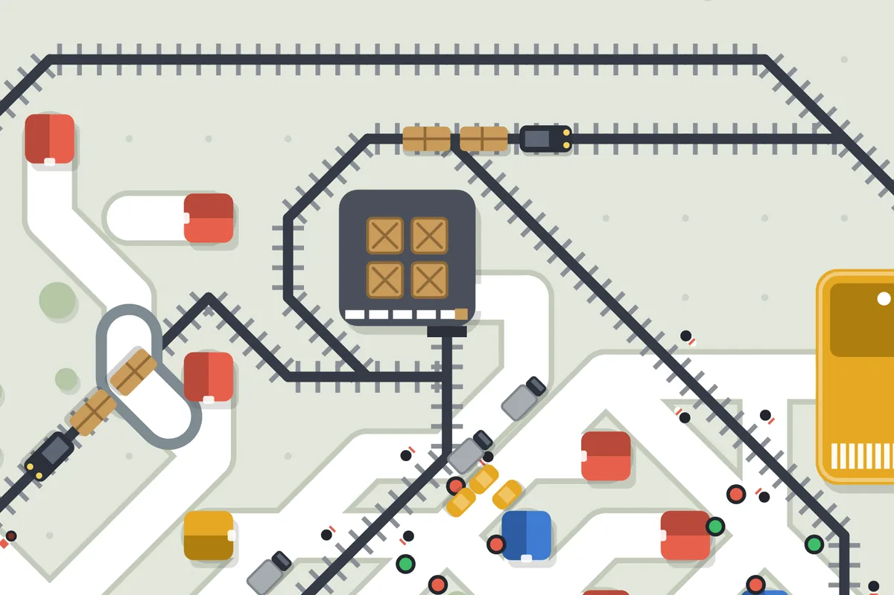<br><b>Depozitele tale</b><br>Tu alegi trenurile si camioanele fiecarui depozit si ce culori aprovizioneaza.</td>
<td valign="top">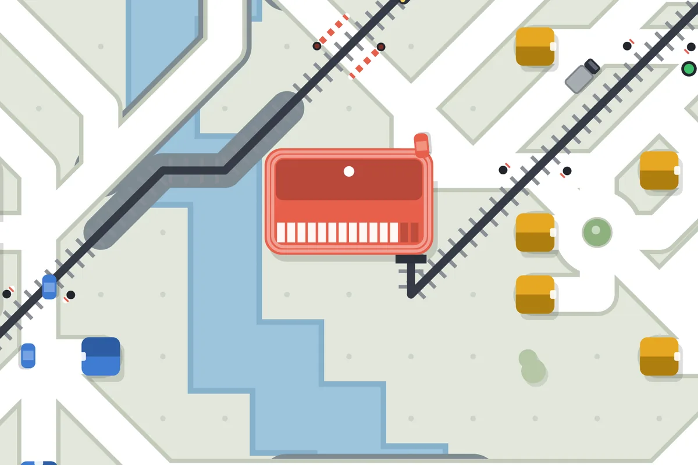<br><b>Magazine care cresc</b><br>Magazinele bine servite urca pana la nivelul 3, cu tot mai multi clienti.</td>
</tr>
</table>

La sfarsitul fiecarei saptamani primesti drum nou si alegi un bonus din noua: trenuri, camioane, cale ferata,
drumuri, poduri, bariere, pasaje, semafoare sau sensuri giratorii.

## Cinci orase romanesti

<table>
<tr>
<td align="center">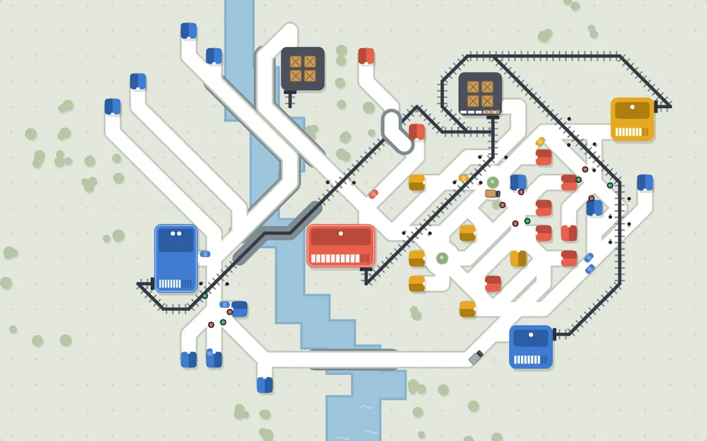<br><b>Cluj</b><br>●○○○○</td>
<td align="center">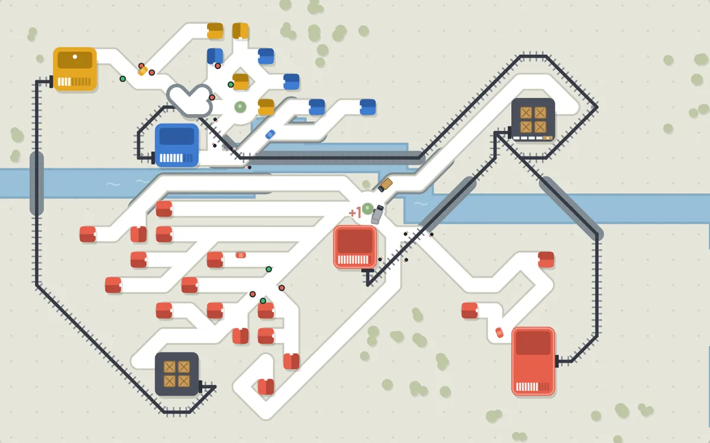<br><b>Timisoara</b><br>●●○○○</td>
<td align="center">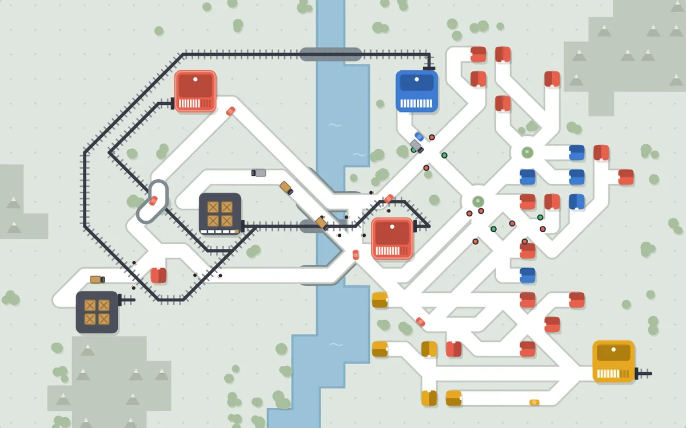<br><b>Brasov</b><br>●●●○○</td>
<td align="center">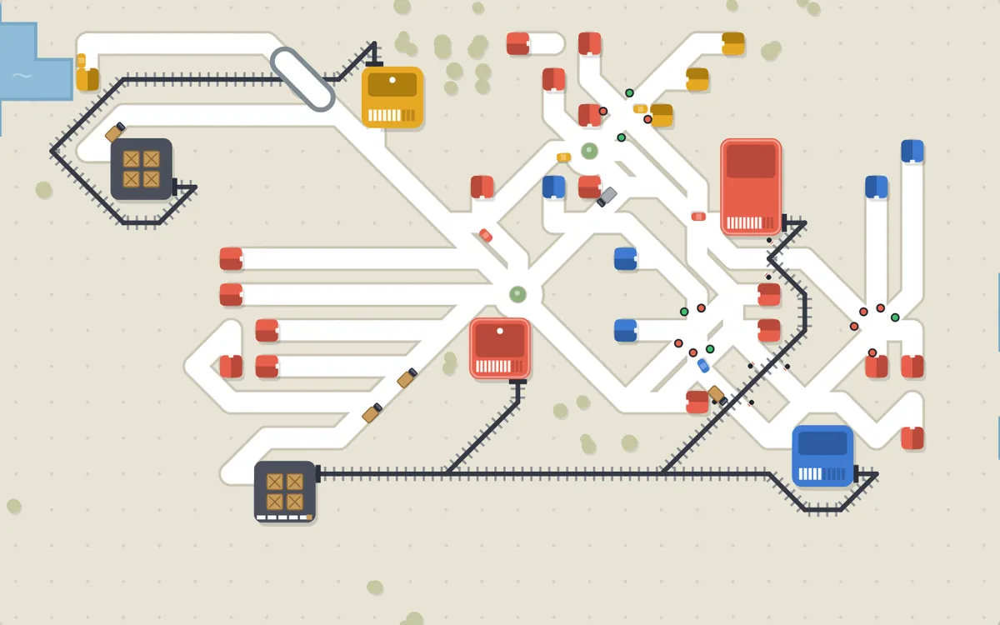<br><b>Constanta</b><br>●●●●○</td>
<td align="center">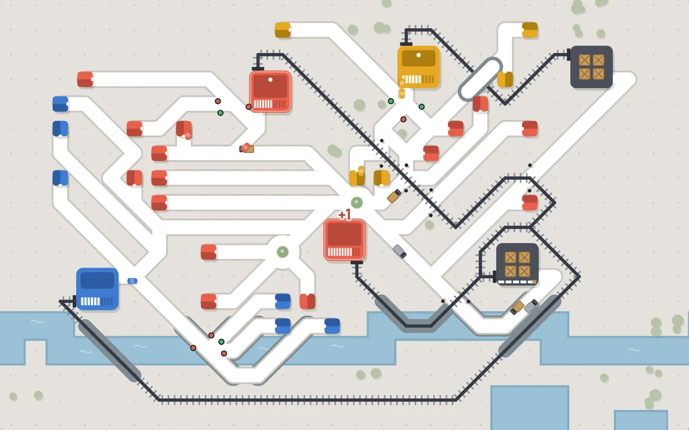<br><b>Bucuresti</b><br>●●●●●</td>
</tr>
</table>

Rauri, lacuri, munti si mare. Fa 80 de livrari intr-un oras ca sa-l deblochezi pe urmatorul.

## Cum se joaca

1. **Leaga casele** - trage un drum de la iesirea casei pana la magazinul de aceeasi culoare.
2. **Adu marfa** - uneste depozitele cu magazinele prin cale ferata sau trimite camioane pe drum.
3. **Evita blocajele** - bariere sau pasaje unde drumul intalneste sina; semafoare si giratorii unde se aglomereaza.
4. **Alege si rezista** - pierzi cand un magazin asteapta prea mult.

| Pe calculator | | Pe telefon | |
|---|---|---|---|
| Mouse | construiesti | Un deget | construiesti |
| Click dreapta | stergi | Doua degete | zoom si mutare |
| Rotita | zoom | Unealta X | sterge |
| `1`-`7` | unelte | Butonul cu colturi | toata harta |
| `Space` / `F` | pauza / viteza | Orizontal | mai mult loc pentru harta |

## Joaca oriunde

| | |
|---|---|
| **In browser** | [Joaca demo-ul](https://seress26.github.io/Joc-Sine-si-Sosele/joaca/), fara descarcare, fara instalare si fara cont. Sau descarca [`index.html`](index.html) si deschide-l cu dublu-click. |
| **Pe telefon** | Deschide [jocul](https://seress26.github.io/Joc-Sine-si-Sosele/joaca/) pe telefon, apoi *Add to Home Screen* (iPhone) sau *Install app* (Android). Merge si fara internet. |
| **Pe Steam** | Versiunea pentru Windows si macOS este in pregatire. Apasa ⭐ *Star* sau *Watch* pe acest repo ca sa afli cand apare. |

<p align="center">

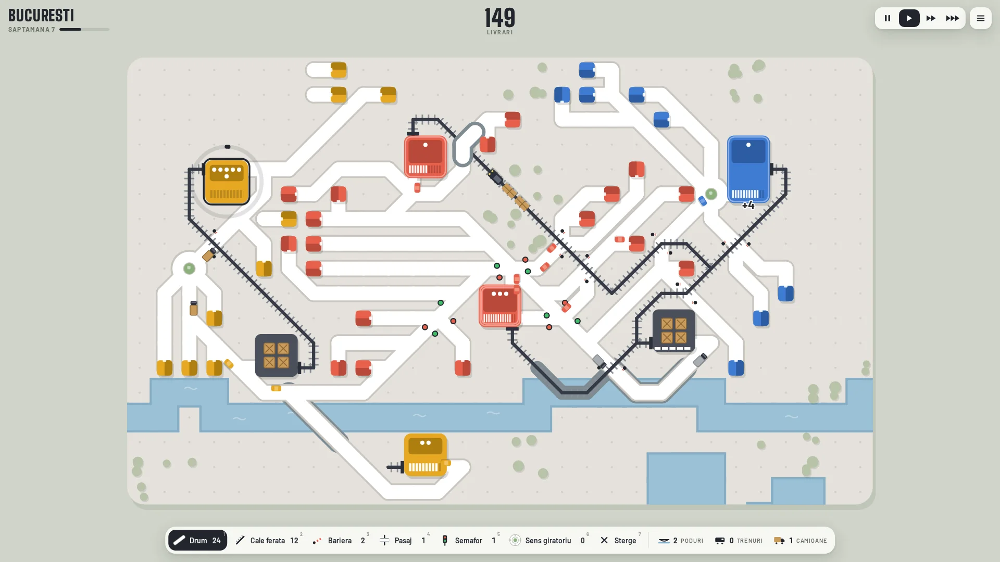
</p>

## Ce urmeaza

- 🚌 **Autobuze si statii** - mai multi oameni deodata, strazi mai libere
- 🌙 **Ore de varf si noapte** - valuri de trafic si orasul luminat
- 📅 **Provocarea zilei** - aceeasi harta pentru toti, cu clasament
- 🌍 **Orase din lume** - harti noi dincolo de Romania

Lista completa: [documentatie/idei-viitoare.md](documentatie/idei-viitoare.md).

## Pentru dezvoltatori

Tot jocul este un singur fisier HTML/JavaScript (canvas 2D, fara biblioteci): [`src/game.html`](src/game.html).

```
python3 build.py      # construieste jocul, versiunea de telefon si pagina de prezentare
npm install && npm start   # aplicatia desktop (Electron)
```

| Folder | Ce contine |
|---|---|
| `src/` | sursa jocului si fonturile |
| `index.html`, `game/`, `mobile/` | jocul gata de jucat: browser, desktop (Steam), telefon (PWA) |
| `docs/` | pagina de prezentare (GitHub Pages), cu jocul in `docs/joaca/` |
| `store/`, `steam/`, `build/` | imaginile pentru Steam, sablonul de urcare, iconita |
| `unelte/` | teste automate, bot de echilibrare, masurari de performanta, filmare si imagini |
| `documentatie/` | ghidul complet, starea proiectului, ideile pentru viitor |
| `istoric/` | versiunile de lucru prin care a trecut jocul |

Ghidul complet (constructie, teste, telefon, pasii pentru Steam): **[documentatie/ghid.md](documentatie/ghid.md)**.

---

<a id="english"></a>
## English

**Sine si Sosele** ("Rails and Roads") is a minimalist traffic strategy game where cars, trains and trucks
share one growing town. Draw roads and railways, guard level crossings with barriers or overpasses,
tame junctions with traffic lights and roundabouts, and decide which trains and trucks serve each depot.
Five Romanian cities, English and Romanian, playable on computer and phone, offline too.

**[▶ Play the free demo in your browser](https://seress26.github.io/Joc-Sine-si-Sosele/joaca/)** · [Game page](https://seress26.github.io/Joc-Sine-si-Sosele/?lang=en) · Coming to Steam (Windows, macOS).

## Licenta / License

Codul si grafica jocului: toate drepturile rezervate. Fonturile din `src/fonts/` (Big Shoulders Display, Barlow)
sunt sub SIL Open Font License 1.1.<br>
Game code and art: all rights reserved. Fonts in `src/fonts/` are under the SIL Open Font License 1.1.
